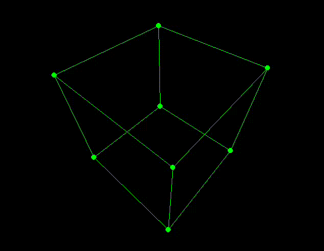
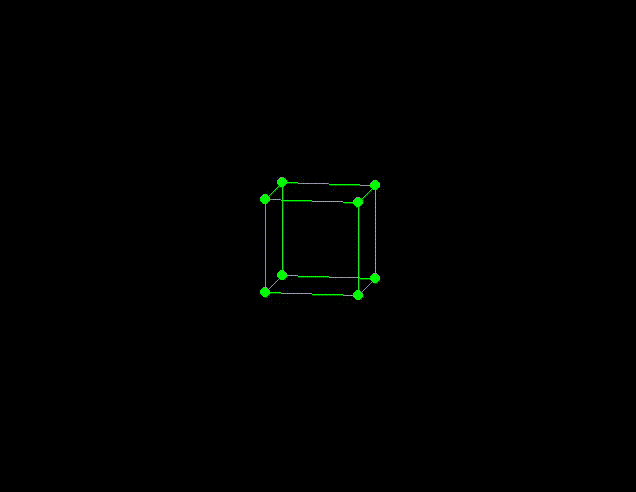

# Simple Perspective Projection

This is a small project I built in order to learn about and experiment with **homogeneous coordinates**, **transformation matrices** and **perspective projection**.

## End Result

### Perspective Projection

### Orthographic Projection

## Basic Operations

### Scaling

$$
\mathbf{S} =
\begin{bmatrix}
s_x & 0 & 0 & 0 \\
0 & s_y & 0 & 0 \\
0 & 0 & s_z & 0 \\
0 & 0 & 0 & 1 \\
\end{bmatrix}
\cdot
\begin{bmatrix}
x \\
y \\
z \\
1 \\
\end{bmatrix}
$$

### Rotation

#### Rotation around the $x$-Axis

- the $x$-coordinate is unchanged and doesn’t influence the result
- the $y$ and $z$ components are projected onto the rotated basis vectors
  - $\mathbf{\hat{i}}$ is simply rotated by $\theta$
  - $\mathbf{\hat{j}}$ can be determined by rotating $\mathbf{\hat{i}}$ by $90°$

$$
\mathbf{\hat{i}} =
\begin{bmatrix}
cos(\theta) \\
sin(\theta)
\end{bmatrix},
\space
\mathbf{\hat{j}} =
\begin{bmatrix}
-sin(\theta) \\
cos(\theta)
\end{bmatrix}
$$

- thus the resulting rotation matrix is:

$$
\mathbf{R}_x = 
\begin{bmatrix}
1 & 0 & 0 & 0 \\
0 & cos(\theta) & -sin(\theta) & 0 \\
0 & sin(\theta) & cos(\theta) & 0 \\
0 & 0 & 0 & 1 \\
\end{bmatrix}
\cdot
\begin{bmatrix}
x \\
\mathbf{y} \\
\mathbf{z} \\
1 \\
\end{bmatrix}
$$

#### Rotation around the $y$-Axis

$$
\mathbf{R}_y =
\begin{bmatrix}
cos(\theta) & 0 & -sin(\theta) & 0 \\
0 & 1 & 0 & 0 \\
sin(\theta) & 0 & cos(\theta) & 0 \\
0 & 0 & 0 & 1 \\
\end{bmatrix}
\cdot
\begin{bmatrix}
\mathbf{x} \\
y \\
\mathbf{z} \\
1 \\
\end{bmatrix}
$$

#### Rotation around the $z$-Axis

$$
\mathbf{R}_y =
\begin{bmatrix}
cos(\theta) & -sin(\theta) & 0 & 0 \\
sin(\theta) & cos(\theta) & 0 & 0 \\
0 & 0 & 1 & 0 \\
0 & 0 & 0 & 1 \\
\end{bmatrix}
\cdot
\begin{bmatrix}
\mathbf{x} \\
\mathbf{y} \\
z \\
1 \\
\end{bmatrix}
$$

### Translation

- translation is done by performing a **shear transformation** in the $4^{th}$ dimension of the homogeneous coordinate system

- to do this, we project our point onto the modified basis vector of the $4^{th}$ dimension

$$
\mathbf{T} =
\begin{bmatrix}
1 & 0 & 0 & t_x \\
0 & 1 & 0 & t_y \\
0 & 0 & 1 & t_z \\
0 & 0 & 0 & 1 \\
\end{bmatrix}
\cdot
\begin{bmatrix}
x \\
y \\
z \\
\mathbf{1} \\
\end{bmatrix}
$$

## Projection

### Aspect Ratio

- we want to project our points onto our **projection window**
- the height and the width of the projection window should range from $[-1; +1]$, because this is easier to work with
- for the $y$-axis, we can simply define that our projection window ranges from $-1$ to $+1$
- doing the same for the $x$-axis would not work, since our screen is not necessarily square
- thus we need to introduce an **aspect ratio** $ar = \frac{w}{h}$
- for the $x$-axis, we now simple define that our projection window ranges from $-ar$ to $+ar$
- by dividing the $x$-values by the aspect ratio, we get our desired range of $[-1; +1]$

### Orthographic Projection

- for orthographic projection, we simply ignore the $z$ component
- this means that there is no depth perception
- we simply need to account for the aspect ratio

$$
\mathbf{P_o} =
\begin{bmatrix}
\frac{1}{ar} & 0 & 0 & 0 \\
0 & 1 & 0 & 0 \\
0 & 0 & 1 & 0 \\
0 & 0 & 0 & 1 \\
\end{bmatrix}
\cdot
\begin{bmatrix}
\mathbf{x} \\
y \\
z \\
1 \\
\end{bmatrix}
$$

### Perspective Projection

- here we want to introduce **depth perception**, thus objects farther away should appear smaller
- we first define a **field of view** $\alpha$ (see [Perspective Projection - OGL dev](https://ogldev.org/www/tutorial12/tutorial12.html) for a visualisation)
- in order to get the projected $y$ component $y_p$, we can use the rule of similar triangles ($z_{near}$ is the distance from the camera to the projection window):

$$
\frac{y_p}{d} = \frac{y}{z} \Rightarrow y_p = \frac{y \cdot z_{near}}{z}
$$

- determining $x_p$ works exactly the same, but we have to account for the aspect ratio as well:

$$
x_p = \frac{x \cdot z_{near}}{z \cdot ar}
$$

- since the $y$-coordinate of the top of the projection window is 1, we can calculate the distance $z_{near}$ from the camera to the projection window as follows:

$$
tan(\frac{\alpha}{2}) = \frac{\text{opposite}}{\text{adjacent}} = \frac{1}{z_{near}} \Rightarrow z_{near} = \frac{1}{tan(\frac{\alpha}{2})}
$$

- putting everything together, we arrive at the following projection matrix:

$$
\mathbf{P_o} =
\begin{bmatrix}
\frac{z_{near}}{z \cdot ar} & 0 & 0 & 0 \\
0 & \frac{z_{near}}{z} & 0 & 0 \\
0 & 0 & 1 & 0 \\
0 & 0 & 0 & 1 \\
\end{bmatrix}
\cdot
\begin{bmatrix}
\mathbf{x} \\
\mathbf{y} \\
z \\
1 \\
\end{bmatrix}
$$

## Resources

- [Perspective Projection - OGL dev](https://ogldev.org/www/tutorial12/tutorial12.html)
- [Why do we use 4x4 Matrices in 3D Graphics? - pikuma](https://www.youtube.com/watch?v=Do_vEjd6gF0)
- [Translation using Shear Transformation - pikuma](https://youtu.be/Do_vEjd6gF0?t=845)
- [Perspective Projection Matrix - pikuma](https://www.youtube.com/watch?v=EqNcqBdrNyI)
- [3D Rendering with Rotation and Projection - The Coding Train](https://www.youtube.com/watch?v=p4Iz0XJY-Qk)

